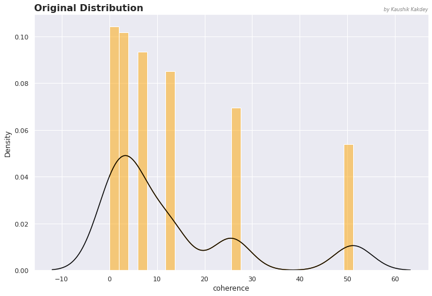
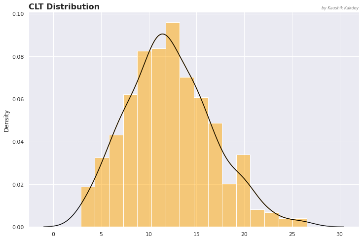

# What is Central Limit Theorem ?
In probability theory, the [central limit theorem](https://en.wikipedia.org/wiki/Central_limit_theorem) establishes that, in many situations, when independent random variables are added, their properly normalized sum tends toward a normal distribution even if the original variables themselves are not normally distributed.

The Central Limit Theorem states that the sampling distribution of the sample means approaches a normal distribution as the sample size gets larger — no matter what the shape of the population distribution. This fact holds especially true for sample sizes over 30.

All this is saying is that as you take more samples, especially large ones, your graph of the sample means will look more like a normal distribution.

 
 

# Plots

<figure>
<h3>Original Distribution</h3>

  
</figure>

<figure>
<h3>CLT Distribution</h3>
  
</figure>

 
 

# CLT in nutshell

<figure>
  
</figure>

 
 

# Try it in your side
Use CLT class to verify if it works. I've provided 6 population datasets. 
All you have to do is provide data to the CLT class and it will its work.

It will result show  2 plots.

1st one will be distribution of original data and\
2nd will be CLT distribution.

You would observe that CLT distribution is more normally distributed then the original distribution, and more elements you take in sampling it tends to get more normally distributed.

 
 

# References
[Khan Academy](https://www.khanacademy.org/math/ap-statistics/sampling-distribution-ap/sampling-distribution-mean/v/central-limit-theorem)

[Statistics How To](https://www.statisticshowto.com/probability-and-statistics/normal-distributions/central-limit-theorem-definition-examples/)

[Central Limit Theorem - Wiki](https://en.wikipedia.org/wiki/Central_limit_theorem)
